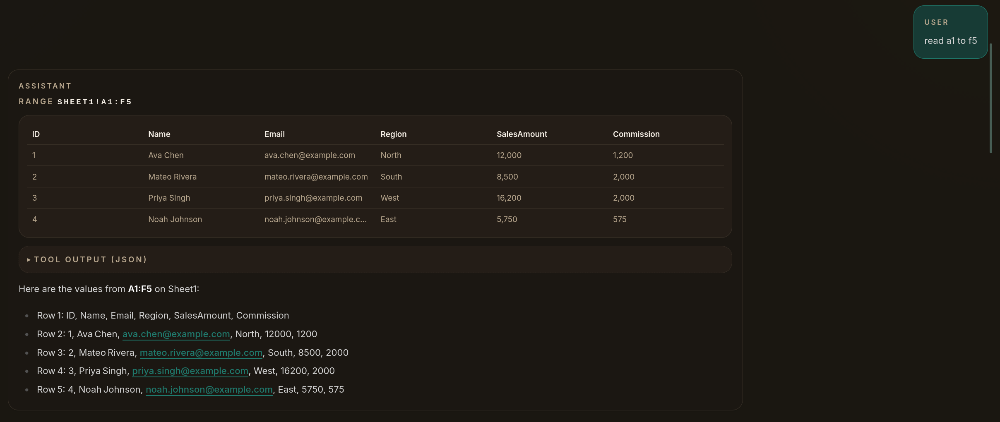
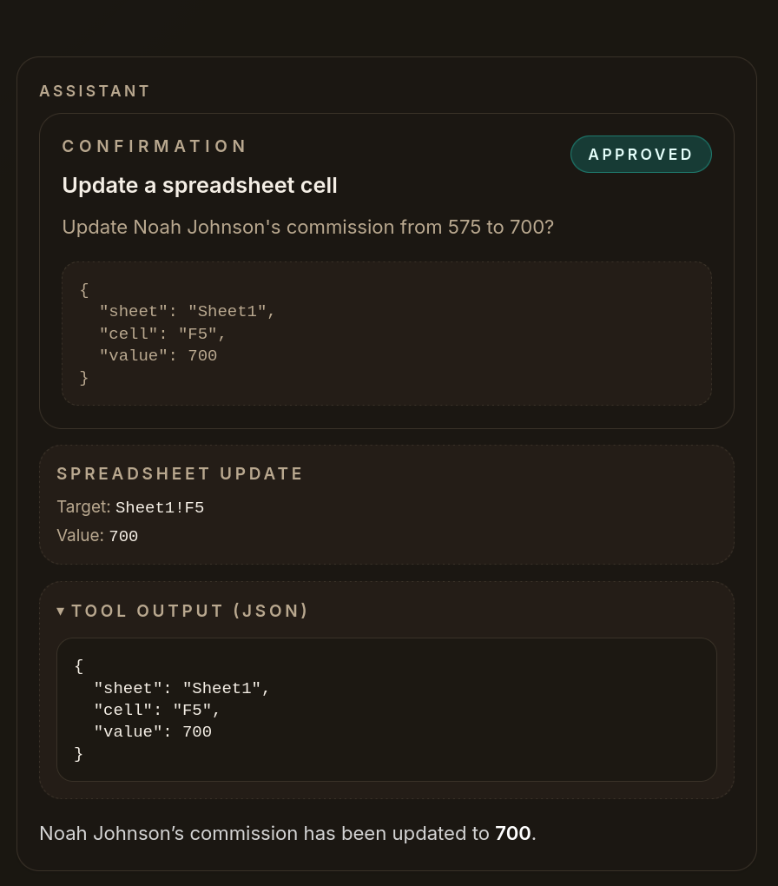

# Threaded Sheet Chat (Next.js + Bun)

A demo / assignment app: ChatGPT-style UI with threaded conversations, SQLite persistence (via Bun), and spreadsheet tools over a bundled XLSX.

## Features

- Threaded conversations stored in SQLite (create/switch threads; history loads per thread).
- Streaming chat via Vercel AI SDK UI (`useChat`) + server streaming route (`POST /api/chat`).
- Spreadsheet tools for the bundled workbook at `data/example.xlsx` (Sheet1 only):
  - Read ranges and render previews + modal selection → mention insertion (`@Sheet1!A1:C5`).
  - Update individual cells (writes back to `data/example.xlsx`) — gated behind explicit UI confirmation.
  - Explain formulas (reads formula text from a cell).
  - Mock “send invites” tool.
- Dangerous actions (cell edits, thread deletion) require confirmation tokens.

## Generative UI

### Range preview



### Confirmation card



## Requirements

- Bun `>= 1.3`.
- Optional: an OpenAI API key if you want real model responses.

## Quickstart

### 1) Install dependencies

```bash
bun install
```

### 2) Configure environment

Copy `.env.example` → `.env.local` and choose one of the modes below.

#### Option A: Run with no API key (mock chat)

Set:

```bash
MOCK_CHAT=1
DB_PATH=data/app.sqlite
```

No OpenAI calls are made; the UI, tool rendering, thread persistence, and confirmation flows still work.

#### Option B: Run with a real model

Set at minimum:

```bash
OPENAI_API_KEY=...
```

Make sure `MOCK_CHAT` is not set to `1` (unset it or set it to `0`) so the server uses the real model.

Optional:

- `OPENAI_BASE_URL` (OpenAI-compatible providers like OpenRouter)
- `OPENAI_MODEL` (defaults to `gpt-4o-mini`)
- `OPENAI_API_MODE` (`chat` vs `responses`)
- `OPENAI_REFERER`, `OPENAI_TITLE` (useful for OpenRouter attribution)
- `DB_PATH` (SQLite file location; defaults to `data/app.sqlite`)

### 3) Start the dev server

```bash
bun run dev
```

Open `http://localhost:3000`.

## Data & initialization

### SQLite

- Default DB file: `data/app.sqlite` (override via `DB_PATH`).
- Schema is created automatically on first use (`CREATE TABLE IF NOT EXISTS ...`).
- Local sqlite files are ignored by git (`data/*.sqlite*`).

### Workbook (`data/example.xlsx`)

- Bundled workbook: `data/example.xlsx` (single sheet: `Sheet1`).
- If you need to regenerate it:

```bash
bun run scripts/generate-example-xlsx.ts
```

## Using the app

- Create/select threads from the sidebar.
- Mention ranges in chat like `@Sheet1!A1:C5` to reference spreadsheet data.
- When the assistant reads a range, you’ll see a preview card; click it to open a modal grid.
  - Drag to select a sub-range and click “Insert mention” to add it to your draft.
- When the assistant proposes a cell update or thread deletion, approve/decline in the confirmation card.

## Testing

```bash
bun test
bun run typecheck
bun run lint
```

### Playwright e2e

```bash
bunx playwright install
bun run test:e2e
# or
bun run test:e2e:ui
```

E2E runs with `PLAYWRIGHT=1` + `MOCK_CHAT=1` and uses `DB_PATH=test-results/playwright.sqlite` (no API key required).

## Limitations / notes

- SheetJS (`xlsx`) does not recalculate formulas server-side. Formula cells may show cached/stale values until the file is opened in Excel.
- Writing to `data/example.xlsx` assumes a writable filesystem. This is fine for a local assignment, but not serverless-safe without external storage.
- XLSX is trusted-local only (no uploads, no user-controlled paths). Only `Sheet1` is supported and ranges are capped.

## Security

See `SECURITY.md` for details and rationale around using `xlsx` in a trusted-local-only way.
